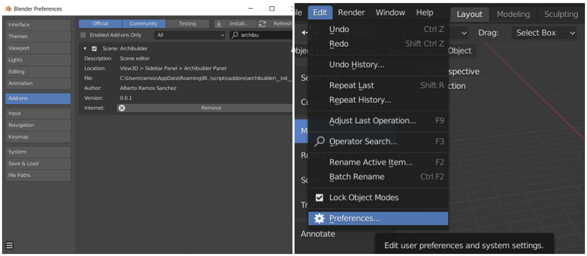

<!--
# Debug execute

1. Install Visual Studio Code
2. Install Blender Development Extension : https://marketplace.visualstudio.com/items?itemName=JacquesLucke.blender-development
3. Install utilities addon in Blender.
3. Open drone_control folder with VSC.
4. Press CTRL-SHIFT-P, execute Blender Start and select Blender executable. Blender will open automatically.

-->

<div id="top"></div>

<!-- PROJECT SHIELDS -->
<!--
*** I'm using markdown "reference style" links for readability.
*** Reference links are enclosed in brackets [ ] instead of parentheses ( ).
*** See the bottom of this document for the declaration of the reference variables
*** for contributors-url, forks-url, etc. This is an optional, concise syntax you may use.
*** https://www.markdownguide.org/basic-syntax/#reference-style-links
-->

<!-- PROJECT LOGO -->
<br />
<div align="center">
  <a href="https://github.com/bertoramos/drone_assistant">
    
  </a>

<h3 align="center">Drone assistant</h3>

  <p align="center">
    Blender addon for drone flight assistance
    <br />
    <a href="https://github.com/bertoramos/drone_assistant"><strong>Explore the docs »</strong></a>
    <br />
    <br />
    <a href="https://www.youtube.com">View Demo</a>
    ·
    <a href="https://github.com/bertoramos/drone_assistant/issues">Report Bug</a>
    ·
    <a href="https://github.com/bertoramos/drone_assistant/issues">Request Feature</a>
  </p>
</div>


<!-- TABLE OF CONTENTS -->
<details>
  <summary>Table of Contents</summary>
  <ol>
    <li>
      <a href="#about-the-project">About The Project</a>
      <ul>
        <li><a href="#built-with">Built With</a></li>
      </ul>
    </li>
    <li>
      <a href="#getting-started">Getting Started</a>
      <ul>
        <li><a href="#prerequisites">Prerequisites</a></li>
        <li><a href="#installation">Installation</a></li>
        <li><a href="#debugging">Debugging</a></li>
      </ul>
    </li>
    <li><a href="#usage">Usage</a></li>
    <li><a href="#contact">Contact</a></li>
  </ol>
</details>

<br>

---

<!-- ABOUT THE PROJECT -->
## About The Project

Drone Assistant is a Blender Addon to give instructions to a drone pilot on how to perform a route within an indoor scenario.

<p align="right">(<a href="#top">back to top</a>)</p>

### Built With

* [Blender 2.93](https://www.blender.org/download/releases/2-93/)
* [Marvelmind Indoor GPS](https://marvelmind.com/)
* [PyBind11](https://github.com/pybind/pybind11)
* [msgpack-python](https://github.com/msgpack/msgpack-python)
* [Visual Studio Code](https://code.visualstudio.com/)
* [Blender Development VSC extension](https://marketplace.visualstudio.com/items?itemName=JacquesLucke.blender-development)

<p align="right">(<a href="#top">back to top</a>)</p>


<!-- GETTING STARTED -->
## Getting Started

This is an example of how you may give instructions on setting up your project locally.
To get a local copy up and running follow these simple example steps.

### Prerequisites

 - Blender 2.93+. Tested on 2.93 LTS version.
 - Marvelmind Indoor GPS.
 - Python binding for Marvelmind C API. [Available here.](https://github.com/bertoramos/marvelmind_pylib)
 - *Archibuilder* and *Filemanager* addons. [Available here.](https://github.com/bertoramos/blender-editor)

### Installation

1. Download and install Blender. You can also use portable version.

2. Install [Marvelmind_pylib binding](https://github.com/bertoramos/marvelmind_pylib).
    1. Go to the path where you can find the python executable included with Blender:
        ```bash
            $ cd blender-install-directory/blender-VERSION-SYSTEM/VERSION/python/bin/
        ```

        For example, in windows for Blender 2.93 LTS: 
        ```bash
            $ cd blender-install-directory/blender-2.93.4-windows-x64/2.93/python/bin
        ```
    2. Execute following instructions:
        ```bash
            $ ./python.exe -m ensurepip
            
            $ ./python.exe -m pip install --upgrade pip
            
            $ ./python pip install https://github.com/bertoramos/marvelmind_pylib/releases/download/VERSION/SO-VERSION-FILE.zip

            $ python.exe -c "import marvelmind_pylib; print(marvelmind_pylib.__doc__)"

            MarvelMindDevice class

        ```

3. Install [msgpack-python](https://github.com/msgpack/msgpack-python) module.

```bash
    $ ./python.exe -m ensurepip

    $ ./python.exe -m pip install --upgrade pip
    
    $ ./python.exe -m pip install msgpack
    
    $ python.exe -c "import msgpack; print(msgpack.__name__, msgpack.version);"

    msgpack (1, 0, 3)

```

4. Activate Measureit addon. To activate Measureit, go to the Preferences tab: Edit > Preferences. Then, in the add-ons tab, look for Measureit and check that the checklist is selected.



5. Download [latest releases](https://github.com/bertoramos/drone_assistant/releases).
    1. Unzip *drone_assistant_VERSION.zip*. You should find two zip files called *drone_control.zip* and *utilities.zip*.
    2. Go to Addon Tab: Edit > Preferences > Add-ons.
    3. Click install and select *utilities.zip*. Repeat with *drone_control.zip*.
    4. Search *Utilities* and *Drone Control* and activate check box.

<!-- 1. Get a free API Key at [https://example.com](https://example.com)
2. Clone the repo
   ```sh
   git clone https://github.com/bertoramos/drone_assistant.git
   ```
3. Install NPM packages
   ```sh
   npm install
   ```
4. Enter your API in `config.js`
   ```js
   const API_KEY = 'ENTER YOUR API';
   ```
-->

### Debugging

1. Follow steps 1 to 4 in the installation section. 

2. In step 5, install only the *Utilities* addon.

3. Install [Visual Studio Code](https://code.visualstudio.com/) and [Blender Development VSC extension](https://marketplace.visualstudio.com/items?itemName=JacquesLucke.blender-development).

4. Open in VSC the *drone_addon* folder.

5. Press CTRL + SHIFT + P, type Blender:Start and press Enter.

6. Select the executable and wait for Blender to open with the addon loaded.

7. After modify code, reload code using *Blender: Reload Addons*. You can also close and reopen Blender by following steps 5 and 6.

<p align="right">(<a href="#top">back to top</a>)</p>

<!-- USAGE EXAMPLES -->
## Usage

### Create drone model

*Drone Panel* contains various functions for the creation of drone models.

Select *Create* to generate a new drone in scene.

Fill drone information and confirm operation. A model will be created in scene.

### Create plan

Plans are sets of points that the drone must reach in a specific order.

There are two ways to create a plan: manual and automatic.

#### Manual waypoint marking

With this mode a route can be created by manually placing points in the scene.

Press *Create* button in *Editor Panel*. Select a name for the new plan and an available drone, and confirm operation. A new panel will open on the left side of the window.

To add a point press *Add pose* button. A new point will appear on the scene. You can move it with [Blender basic transformations](https://docs.blender.org/manual/en/latest/scene_layout/object/editing/transform/move.html).

When you finished, press *save plan* button.

To see plan, choose your new plan in list and press *Select* button. The new plan will appear in scene.


#### Automatic plan creation

With this mode a plan can be created automatically by selecting an area and a distance between points.

Press *Plan generator*, select a name and a drone, and confirm operation. A transparent cube will be generated in scene. Transform this cube to select an area of the scene. 

When you are finished, press space button. Select plan and a point cloud will appear on the scene: this is the route.

### Plan execution

To execute the route, follow these steps:

1. Press *Connect* button.
2. Press *Calibrate* button. Then, move scene and plan to align Blender and Marvelmind system coordinates.
3. Press *Options*>*Show HUD information* button.
4. Press *Play* button to start route. Now you can see information on how to reach each point with the drone.
5. To start BLE capture, press *Capture* button and select capture time. 

<p align="right">(<a href="#top">back to top</a>)</p>

<!-- CONTACT -->
## Contact

Alberto Ramos Sánchez - [alberto.ramos104@alu.ulpgc.es](mailto:alberto.ramos104@alu.ulpgc.es)

Project Link: [https://github.com/bertoramos/drone_assistant](https://github.com/bertoramos/drone_assistant)

<p align="right">(<a href="#top">back to top</a>)</p>